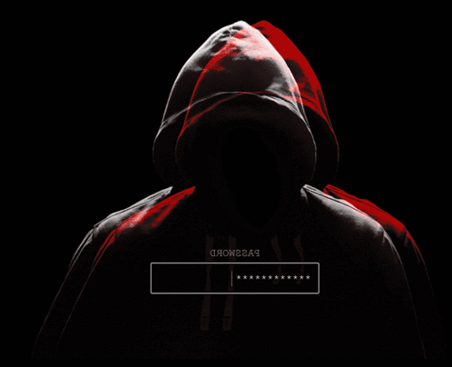

<!-- ANIMATED HEADER -->

 

<!-- ANIMATED TYPING -->

  

<!-- BADGES -->

&nbsp;

&nbsp;

---

<!-- ABOUT ME -->

---

<!-- SNAKE ANIMATION -->

<picture>
  <source media="(prefers-color-scheme: dark)" srcset="https://raw.githubusercontent.com/XTM26/XTM26/output/github-snake-dark.svg" />
  <source media="(prefers-color-scheme: light)" srcset="https://raw.githubusercontent.com/XTM26/XTM26/output/github-snake.svg" />
  
</picture>

---

<!-- TECH STACK -->

 

 

 

 

---

<!-- GITHUB STATS -->

 

&nbsp;&nbsp;

  

---

<!-- ACTIVITY GRAPH -->

 

---

<!-- TROPHIES -->

 

---

<!-- PROFILE SUMMARY -->

 

 

&nbsp;

&nbsp;

---

<!-- STATUS BADGES -->

 

&nbsp;

&nbsp;

&nbsp;

---

<!-- QUOTE -->

 

---

<!-- FOOTER -->

